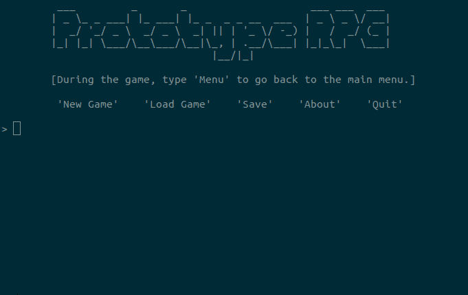

# Persistence

## NOTE - JANUARY 2023

**_The project is halted._** However, this doesn't mean I won't make an MMO. What is halted is the development of the MMO using low-level technology. For certain reasons, I cannot afford to develop the game this way at this time. And to be honest, although it's likely the MMO will be low-level, I cannot confirm I'll ever develop the game this way, or if I'll just go with a commercial engine. What I know is that I keep this repo around and let it keep the old name of *Persistence* in order not to confuse the different repos. Indeed, the MMO project has a new name, that I won't disclose at this time.  

**_The reasons_** for this halt is that I'm pursuing a VR/AR course, and if counting from February 2023 I'll be at it for 17 more months. At the end of the course, I am to deliver a Unity-using VR or AR "masterpiece" project showcasing all that I've learned. Given that most of this time will involve an internship contract, so a fulltime job, I seriously don't know how I'll find time to work, to study, and to develop the masterpiece project. I also need to earn a few more bucks beyond my salary, because I need to get new soft and hardware, so I should develop a few humble games. And, it also pains me not to kickstart my indie career at all during this time, so... Humble games it is! And YouTube! And did I mention wanting to be a vtuber as well? Well, at least I have an excuse for this one, as being a vtuber is not only fun, it also makes me more visible online. All of that, to say that the least I can do to make it, is to seize the opportunity of the masterpiece project to make some kind of MMO prototype for you guys. Unless there's a miracle or I'm more skilled that I thought, I obviously won't launch a crowdfunding campaign for the MMO while still following the course, but the prototype doesn't have to be a mere demo in the context of a campaign. It is its own game, that I'll release with a price tag.  

Therefore, let's welcome the new flagship project: [Imnun: Edge of the Civilized World](https://github.com/TheLycorisRadiata/game_unity_imnun)!   

Imnun is a solo VR RPG, and its role regarding the MMO is to be the prototype of the prototype. I'll do a proper MMO prototype someday, maybe low-level, and probably solo still, but right now I need a finished game to show the course jury. And, preferably, I need to show that it has made a few bucks, because in this course we don't only learn realtime 3D, VR and AR development, we also learn to analyse a project's target demographics and to plan development accordingly, and what's more of a showcase than sales made!  

---

## OLD NOTE

**Project type:** PC video game project.  
**Brief description:** Development of a cross-platform video game (Windows, Mac and Linux) written without a game engine. For now text-based and solo, the ambition is to make it a VRMMORPG.  
**Technologies:** C.  

*Persistence* is the name of a VRMMORPG project, which means "Virtual Reality Massively Multi Player Role Playing Game". My strategy for its development is to focus on game mechanics instead of graphics, and whereas it is a virtual reality game, which already implies 3D, a big chunk of the game can be developped without any audiovisual aspect, which is why it will remain in text form for a good while. This young project just begun as a "text adventure", that is to say a game where the player acts by entering written commands. Its difference from a classic text adventure is that it offers suggestions when the player is lost, and since this reveals the plot it's usually considered as spoiling the player's enjoyment. The objective not being to really develop a text adventure but to use this genre as a springboard for a virtual reality game, I've allowed myself to make the handling of the game more accessible, which I hope will attract players more easily and therefore increase my chances of receiving critiques so as development happens in the best manner.  

The game understands several commands, can save the ongoing game, and has events. An event example is to have the doors lock up the player inside when they cross the mansion's threshold for the first time. The game also contains a mini-game entitled "[Twenty Squares](https://github.com/TheLycorisRadiata/game_twentysquares)", that I leave you to discover as well as the game itself.  

---

I wonder why anyone would want to work on the project at this time, but if you're thinking of contacting me about this: forget it. *Persistence* will need a team at some point, but this is way too soon.

---

The idea came around 2015 and I've started development on 03/17/21.

**DEVELOPMENT IS 70 DAYS LONG SO FAR**  
IN 2021
- [52 days] MARCH & APRIL: From 03/17/21 to 04/05/21 + From 04/07/21 to 04/26/21.
- [2 days] MAY: On 05/06/21 + On 05/11/21.
- [3 days] AUGUST: On 08/08/21 + On 08/10/21 + On 08/12/21.

IN 2022
- [13 days] APRIL: From 04/01/22 to 04/02/22 + From 04/07/22 to 04/15/22 + On 04/17/22 + On 04/19/22.

